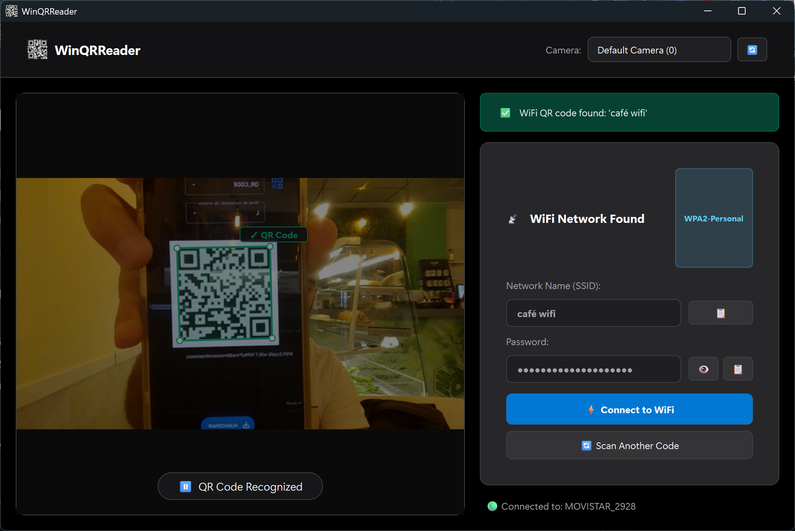

# WinQRReader

Desktop application for QR code scanning and automatic Windows WLAN profile provisioning.

<p align="center">
  
</p>

## Requirements

- **OS**: Windows 10 / 11 (x64)
- **Python**: 3.10+
- **Hardware**: Integrated or USB webcam, 802.11 WLAN adapter

## Installation & Execution

### Run from Source
```powershell
pip install -r requirements.txt
python main.py
```

### Build Standalone Executable
```powershell
python build_exe.py
```
Output artifact: `dist/WinQRReader/WinQRReader.exe`

## Architecture

For architecture specifications, component breakdowns, and threading models, refer to [AGENTS.md](AGENTS.md).

## Testing

Run unit and integration test suite:
```powershell
python -m unittest discover -s tests -v
```
